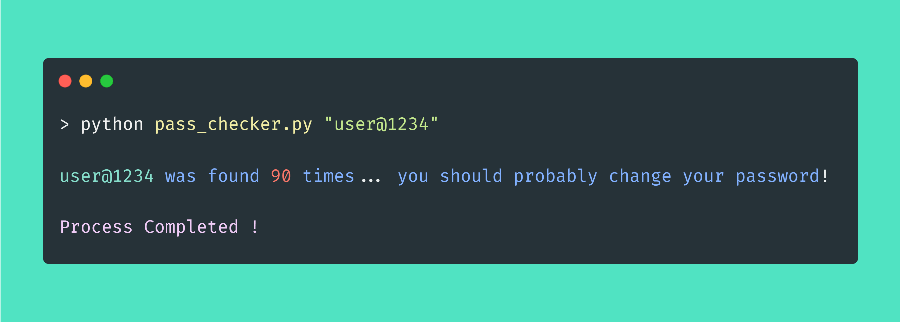
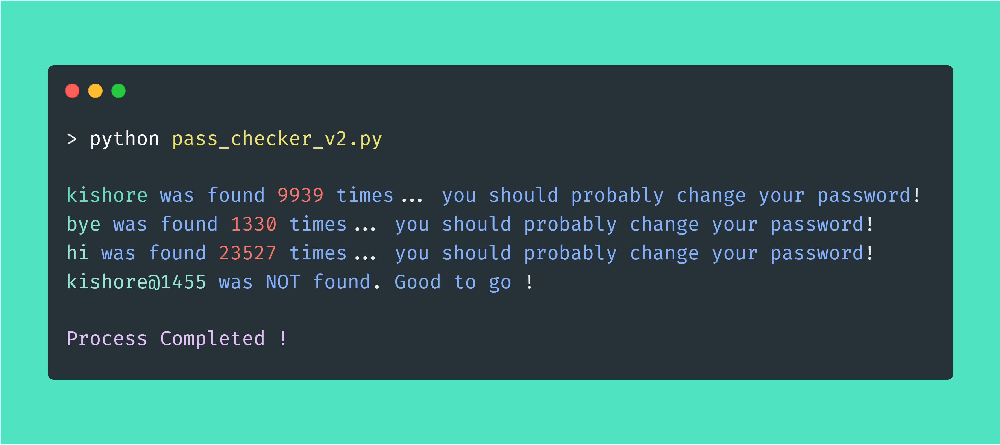

**Usage:** Using this script, you can get to know whether your password is ever involved in some kind of data breach or ever hacked 🐱‍💻

---
### Workflow of password checker

> 1. Passwords gets hashed, by passing them into an hasing algorithm like **`SHA1`** and which is further divided into 2 parts (the first 5 characters of the Hash known as the head part, and the rest  characters are consdiered as the tail part)
>
>  2. Then head part of the hash is passed as an query in the API Request, for which the response received is a list of tail part of password hashes, and the number of times the password is involved in an data breach.
>  
>  3. Both of these information are fetched from the API server's database, which are constantly updated with the new breached and hacked password hashes.
>  
>  4.  At last, the tail part of hash generated is compared with the list of hashes which are received from the API's database, in order to check the password's strength. In case if any of hash from the list is matched with the tail part, the count will be displayed; else your password is secure and good to go. 
>
> 5. The process of using the head part of an hash generated, rather than using the entire hash value is known as [**k-anonymity**](https://en.wikipedia.org/wiki/K-anonymity).

---

### Console Output:

 
 

---

### Console Output (Version 2)

**what's new with this version? :** Well, with the previous version chances are there that the password you typed in the console might get stored in history. Hence the `pass_checker_v2.py` overcomes this, by reading the input from an text file (`secret.txt` in this case), instead of console. 

> **Additional Tip:** You can go ahead and increase the security further, by encrypting the text file; if required.  

 
 

---

📑 Libary reference: [**`Hashlib`**](https://docs.python.org/3/library/hashlib.html) | [**`requests`**](https://docs.python-requests.org/en/latest/) | [**`sys`**](https://docs.python.org/3/library/sys.html)
